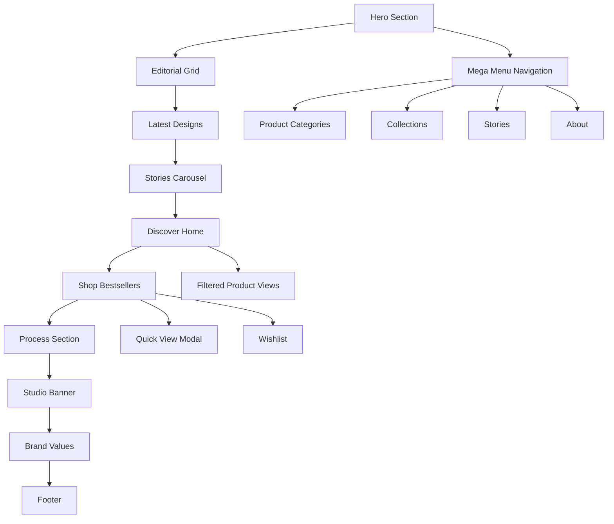

# Product Requirements Document - Modern Nature Design Nepal

## 1. Product Overview

Modern Nature Design Nepal is a premium e-commerce storefront for handcrafted rugs that bridges traditional Nepalese craftsmanship with contemporary interior design. The platform showcases artisanal rugs through an immersive, content-rich marketing experience that emphasizes heritage, quality, and modern aesthetics.

- **Target Audience**: Interior designers, homeowners seeking premium decor, and conscious consumers valuing handcrafted artisanal products
- **Market Value**: Positioning as a luxury lifestyle brand that connects customers with authentic Nepalese craftsmanship while providing a seamless digital shopping experience

## 2. Core Features

### 2.1 Feature Module

Our e-commerce rugs storefront consists of the following main sections:

1. **Hero Section "Interior Alchemy"**: Split-screen hero with autoplay slider, headline overlay, and dual CTAs
2. **Editorial Grid "Heritage meets modern"**: Masonry layout showcasing brand stories and craftsmanship
3. **Latest Textural Rug Designs**: Featured product showcase with texture close-ups
4. **Stories From Our World**: Horizontal scrolling carousel of brand narratives
5. **Discover Home**: Interactive room-based product discovery tiles
6. **Shop Bestsellers**: Product grid with quick-view functionality
7. **How Our Rugs Are Created**: Process storytelling with scroll animations
8. **Studio Banner + Visit Us**: Brand presence and showroom information
9. **Brand Values Strip**: Core company principles display
10. **Footer**: Comprehensive navigation and newsletter signup

### 2.2 Page Details

| Page Name | Module Name | Feature Description |
|-----------|-------------|---------------------|
| Hero Section | Split Hero Layout | Full-bleed image with headline card overlay, cozy living room scene, autoplay slider (3 scenes, 6s interval, fade transition, pause-on-hover) |
| Hero Section | Call-to-Actions | Primary "Shop Rugs" button and ghost "Visit Stores" button with hover effects |
| Editorial Grid | Masonry Layout | 5-6 editorial cards with image, eyebrow text, title, "Read more" link, hover lift and shadow effects |
| Latest Designs | Product Showcase | Three wide cards featuring textured close-ups, product names, descriptors, "View more" button |
| Stories Carousel | Horizontal Scroll | 4-6 story cards with snap-x scrolling, prev/next buttons, dot indicators, keyboard navigation |
| Discover Home | Interactive Tiles | Three room-based tiles (styled room, bathroom, hallway) with hover label chips, filtered product links |
| Shop Bestsellers | Product Grid | 2x4 desktop grid, 2-column mobile, product cards with image, name, price, color swatches, wishlist, disabled "Add to bag" |
| Process Section | Two-Column Layout | Step captions over process images, scroll-triggered animations, numbered steps reveal |
| Studio Banner | Brand Showcase | Studio photo with embossed gold logo overlay, "Visit Us" card with showroom CTA |
| Brand Values | Icon Strip | Three value propositions: Handcrafted, Responsible Sourcing, Artisanal Care with descriptions |
| Navigation | Mega Menu | Shop categories (By Room, By Style, New In, Bestsellers), Collections, Stories, About with mobile drawer |
| Footer | Multi-Column | Shop links, About, Customer Care, Contact, Social media, newsletter signup with success toast |

## 3. Core Process

**Main User Journey:**
1. User lands on hero section and views autoplay slider showcasing interior scenes
2. User explores editorial content through masonry grid to understand brand heritage
3. User discovers latest rug designs through textural showcase cards
4. User browses brand stories via horizontal carousel with keyboard/mouse controls
5. User explores room-based product discovery through interactive home tiles
6. User views bestselling products in grid layout with quick-view modal functionality
7. User learns about craftsmanship process through animated scroll sections
8. User can access showroom information and brand values
9. User navigates through mega menu or subscribes to newsletter in footer

## 4. User Interface Design

### 4.1 Design Style

- **Primary Colors**: Mint-green #CDE6DC, Off-white #FAF7F2, Warm beige #E9DFD3, Charcoal #1F1F1F
- **Typography**: Inter for UI elements and body text, Playfair Display for headings and brand elements
- **Button Style**: Rounded corners with subtle shadows, primary buttons in charcoal, ghost buttons with mint-green borders
- **Layout Style**: Card-based design with generous whitespace, top navigation with sticky behavior, 1280px max container width
- **Icon Style**: Minimalist line icons with consistent stroke width, subtle animations on hover

### 4.2 Page Design Overview

| Page Name | Module Name | UI Elements |
|-----------|-------------|-------------|
| Hero Section | Split Layout | Full-bleed background image (left), content overlay card with Playfair Display headline, Inter body text, rounded CTA buttons with hover states |
| Editorial Grid | Masonry Cards | Responsive grid with varying card heights, soft shadows, hover lift effects, mint-green accent borders |
| Latest Designs | Showcase Cards | Wide aspect ratio cards with texture close-ups, overlay text in off-white backgrounds, subtle border radius |
| Stories Carousel | Horizontal Scroll | Snap-scroll behavior, custom navigation arrows in charcoal, dot indicators with mint-green active state |
| Discover Home | Interactive Tiles | Square aspect ratio tiles with overlay labels, hover reveal animations, warm beige background accents |
| Shop Bestsellers | Product Grid | Consistent card sizing, product images with 4:3 aspect ratio, color swatch circles, heart icon wishlist |
| Process Section | Two-Column | Numbered steps with mint-green circles, process images with subtle borders, scroll-triggered fade-in animations |
| Navigation | Mega Menu | Sticky header with subtle shadow on scroll, dropdown menus with off-white backgrounds, mobile slide-over drawer |
| Footer | Multi-Column | Charcoal background with off-white text, newsletter input with mint-green submit button, social icons with hover effects |

### 4.3 Responsiveness

Desktop-first approach with mobile-adaptive breakpoints:
- **Mobile (375px)**: 2-column grid, stacked navigation, touch-optimized interactions
- **Tablet (768px)**: 6-column grid, condensed navigation, swipe gestures for carousels
- **Desktop (1024px+)**: 12-column grid, full mega menu, hover states and animations
- **Large Desktop (1280px+)**: Maximum container width with centered content
- **Extra Large (1536px+)**: Enhanced spacing and larger typography scale

Touch interaction optimization for mobile devices with appropriate tap targets (minimum 44px) and swipe gestures for carousel navigation.