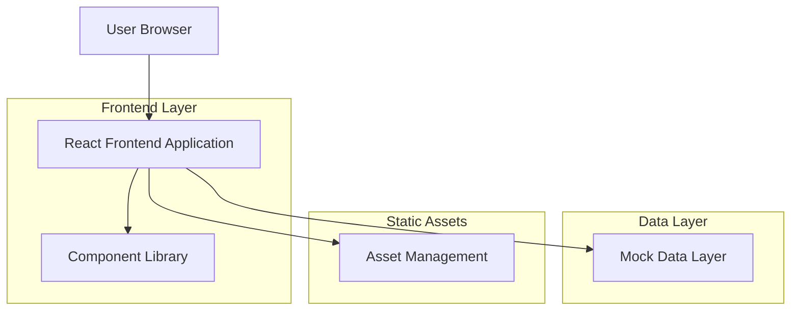
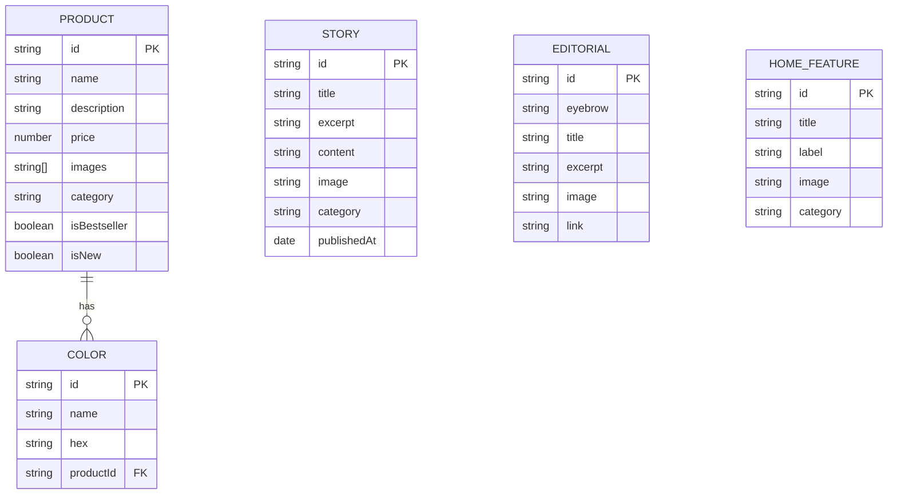

# Technical Architecture Document - Modern Nature Design Nepal

## 1. Architecture Design



## 2. Technology Description

* **Frontend**: React\@18 + TypeScript\@5 + Vite\@5

* **Styling**: Tailwind CSS\@3 + @tailwindcss/typography + @tailwindcss/container-queries

* **State Management**: React Context API + useState/useReducer hooks

* **Data**: Static JSON files for mock data

* **Assets**: Local images (JPG/WebP) + Unsplash placeholders

* **Build Tool**: Vite with TypeScript support and hot module replacement

## 3. Route Definitions

| Route         | Purpose                                               |
| ------------- | ----------------------------------------------------- |
| /             | Home page with all sections (single-page application) |
| /#hero        | Hero section with Interior Alchemy theme              |
| /#editorial   | Heritage meets modern editorial grid                  |
| /#designs     | Latest Textural Rug Designs showcase                  |
| /#stories     | Stories From Our World carousel                       |
| /#discover    | Discover Home interactive tiles                       |
| /#bestsellers | Shop Bestsellers product grid                         |
| /#process     | How Our Rugs Are Created section                      |
| /#studio      | Studio banner and Visit Us information                |
| /#values      | Brand values strip                                    |

## 4. Component Architecture

### 4.1 Core Components

**Layout Components:**

```typescript
// Navigation
Navbar: React.FC<{ isScrolled: boolean }>
MegaMenu: React.FC<{ isOpen: boolean }>
MobileDrawer: React.FC<{ isOpen: boolean; onClose: () => void }>

// Layout Utilities
Container: React.FC<{ className?: string; children: React.ReactNode }>
SectionHeading: React.FC<{ title: string; subtitle?: string; alignment?: 'left' | 'center' }>
Breadcrumb: React.FC<{ items: BreadcrumbItem[] }>
```

**Product Components:**

```typescript
ProductCard: React.FC<{
  product: Product;
  onQuickView: (id: string) => void;
  onWishlist: (id: string) => void;
}>

ColorSwatch: React.FC<{
  colors: Color[];
  selectedColor?: string;
  onColorSelect: (color: string) => void;
}>

QuickViewModal: React.FC<{
  product: Product | null;
  isOpen: boolean;
  onClose: () => void;
}>
```

**Content Components:**

```typescript
StoryCard: React.FC<{
  story: Story;
  variant?: 'default' | 'featured';
}>

EditorialCard: React.FC<{
  editorial: Editorial;
  size?: 'small' | 'medium' | 'large';
}>

FeatureTile: React.FC<{
  feature: HomeFeature;
  onHover: (label: string) => void;
}>

ValueIcon: React.FC<{
  icon: string;
  title: string;
  description: string;
}>
```

**Interactive Components:**

```typescript
Carousel: React.FC<{
  items: CarouselItem[];
  autoplay?: boolean;
  interval?: number;
  showDots?: boolean;
  showArrows?: boolean;
}>

BentoGrid: React.FC<{
  items: GridItem[];
  columns: { sm: number; md: number; lg: number };
}>

MasonryGrid: React.FC<{
  items: MasonryItem[];
  gap?: number;
}>

SkeletonLoader: React.FC<{
  variant: 'card' | 'text' | 'image';
  count?: number;
}>
```

### 4.2 Custom Hooks

```typescript
// Scroll and intersection hooks
useScrollPosition: () => { scrollY: number; isScrolled: boolean }
useIntersectionObserver: (ref: RefObject<Element>) => boolean

// UI state management
useModal: () => { isOpen: boolean; open: () => void; close: () => void }
useCarousel: (itemCount: number, autoplay?: boolean) => CarouselState

// Data fetching (mock)
useProducts: () => { products: Product[]; loading: boolean }
useStories: () => { stories: Story[]; loading: boolean }
```

## 5. Data Model

### 5.1 Data Model Definition



### 5.2 Data Definition Language

**Products Data (data/products.json)**

```json
{
  "products": [
    {
      "id": "rug-001",
      "name": "Himalayan Heritage",
      "description": "Hand-knotted wool rug with traditional Nepalese patterns",
      "price": 1299,
      "images": [
        "/assets/rugs/himalayan-heritage-1.jpg",
        "/assets/rugs/himalayan-heritage-2.jpg"
      ],
      "colors": [
        { "id": "c1", "name": "Charcoal", "hex": "#1F1F1F" },
        { "id": "c2", "name": "Mint", "hex": "#CDE6DC" },
        { "id": "c3", "name": "Beige", "hex": "#E9DFD3" }
      ],
      "category": "living-room",
      "isBestseller": true,
      "isNew": false,
      "dimensions": "8' x 10'",
      "material": "100% Wool"
    }
  ]
}
```

**Stories Data (data/stories.json)**

```json
{
  "stories": [
    {
      "id": "story-001",
      "title": "The Art of Hand-Knotting",
      "excerpt": "Discover the centuries-old tradition behind our rugs",
      "content": "Full story content...",
      "image": "/assets/stories/hand-knotting.jpg",
      "category": "craftsmanship",
      "publishedAt": "2024-01-15"
    }
  ]
}
```

**Editorial Content (data/editorial.json)**

```json
{
  "editorial": [
    {
      "id": "edit-001",
      "eyebrow": "Heritage",
      "title": "Where Tradition Meets Innovation",
      "excerpt": "Exploring the intersection of ancient craft and modern design",
      "image": "/assets/editorial/tradition-innovation.jpg",
      "link": "#stories"
    }
  ]
}
```

**Home Features (data/home-features.json)**

```json
{
  "features": [
    {
      "id": "feat-001",
      "title": "Living Room",
      "label": "Area Rugs",
      "image": "/assets/rooms/living-room.jpg",
      "category": "living-room"
    },
    {
      "id": "feat-002",
      "title": "Bathroom",
      "label": "Bath Mats",
      "image": "/assets/rooms/bathroom.jpg",
      "category": "bathroom"
    },
    {
      "id": "feat-003",
      "title": "Hallway",
      "label": "Runner Rugs",
      "image": "/assets/rooms/hallway.jpg",
      "category": "hallway"
    }
  ]
}
```

## 6. Styling System

### 6.1 Tailwind Configuration

```javascript
// tailwind.config.js
module.exports = {
  content: ['./index.html', './src/**/*.{js,ts,jsx,tsx}'],
  theme: {
    extend: {
      colors: {
        'mint-green': '#CDE6DC',
        'off-white': '#FAF7F2',
        'warm-beige': '#E9DFD3',
        'charcoal': '#1F1F1F'
      },
      fontFamily: {
        'sans': ['Inter', 'system-ui', 'sans-serif'],
        'serif': ['Playfair Display', 'Georgia', 'serif']
      },
      maxWidth: {
        'container': '1280px'
      },
      spacing: {
        'gutter': '24px'
      },
      gridTemplateColumns: {
        'sm': 'repeat(2, 1fr)',
        'md': 'repeat(6, 1fr)',
        'lg': 'repeat(12, 1fr)'
      }
    }
  },
  plugins: [
    require('@tailwindcss/typography'),
    require('@tailwindcss/container-queries')
  ]
}
```

### 6.2 Asset Structure

```
/public
  /assets
    /rugs
      - himalayan-heritage-1.jpg
      - himalayan-heritage-2.webp
      - textural-close-up-1.jpg
    /rooms
      - living-room.jpg
      - bathroom.jpg
      - hallway.jpg
    /stories
      - hand-knotting.jpg
      - artisan-profile.jpg
    /editorial
      - tradition-innovation.jpg
    /studio
      - workshop.jpg
    /icons
      - handcrafted.svg
      - responsible-sourcing.svg
      - artisanal-care.svg
  - favicon.ico
  - social-preview.jpg
```

